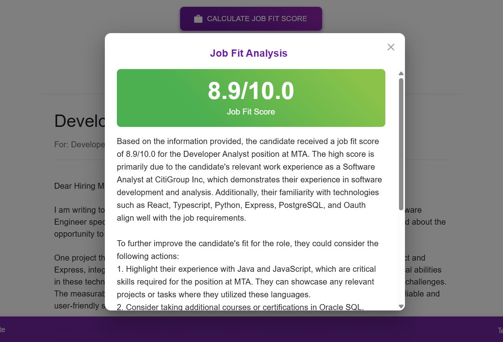

# Resumate

## Project Overview
Resumate is an AI-powered resume and cover letter creation platform designed to help job seekers create professional documents that improve their chances of landing interviews. The application combines traditional document creation with advanced AI capabilities for job fit scoring, customized cover letter generation, and resume optimization.



## Contents
* [Demo](./client/demo.md)
* [Key Features](#key-features)
* [Technical Implementation](#technical-implementation)
* [Getting Started](#getting-started)
* [Component Architechture](#component-architecture)

## Key Features
- **Resume Builder**: Intuitive multi-step form with comprehensive validation for creating detailed resumes
- **Cover Letter Generator**: AI-powered cover letter creation based on resume data and job details
- **Job Fit Analysis**: Scoring system using OpenAI embeddings to evaluate how well a resume matches a job description
- **Resume Parser**: Automatically extract information from uploaded .docx and .txt files to populate resume forms
- **Document Management**: Save, view, edit, and print resumes and cover letters

## Technical Implementation

### AI Integration
- **Embedding-based Job Scoring**: Utilizes OpenAI's text-embedding-ada-002 model to calculate semantic similarity between resumes and job descriptions
- **Personalized Feedback**: AI-generated explanations for job fit scores with actionable improvement suggestions
- **Cover Letter Generation**: Context-aware cover letter creation with customizable tone, length, and focus areas

### Architecture
- **Frontend**: React with TypeScript and Material UI for a responsive, accessible interface
- **Backend**: Node.js/Express server handling API requests and AI integrations
- **State Management**: Redux for centralized state with slice-based organization
- **Database**: PostgreSQL with Sequelize ORM for data persistence
- **API Communication**: RESTful API design with structured request/response patterns

## Getting Started

### Prerequisites
- Node.js (v14+)
- PostgreSQL database
- OpenAI API key for AI features

### Installation
1. Clone the repository:
   ```bash
   git clone https://github.com/username/resumate.git
   cd resumate
   ```

2. Install server dependencies:
   ```bash
   cd server
   npm install
   ```

3. Configure environment variables in `server/.env`:
   ```
   DB_NAME=resumate_db
   DB_USER=your_db_user
   DB_PASSWORD=your_db_password
   DB_HOST=localhost
   OPENAI_API_KEY=your_openai_api_key
   PORT=5000
   ```

4. Set up the database:
   ```bash
   npm run migrate
   ```

5. Install client dependencies:
   ```bash
   cd ../client
   npm install
   ```

6. Start the development servers:
   
   Server:
   ```bash
   cd ../server
   npm run dev
   ```
   
   Client:
   ```bash
   cd ../client
   npm start
   ```

## Component Architecture

### Resume Creation Flow
1. Multi-step form with validation at each step
2. Optional resume parsing to extract data from existing documents (Currently Disabled)
3. Real-time preview of the resume being created
4. Form validation ensures data integrity
5. Redux-based state management for consistent data handling

### Job Fit Scoring System
1. Resume content and job descriptions are converted to vector embeddings
2. Semantic similarity calculated using cosine similarity between vectors
3. Component-level scoring for different resume sections
4. AI-generated personalized feedback based on the analysis
5. Color-coded scoring display with detailed explanations

### Cover Letter Generation
1. User inputs job details and selects their resume
2. AI analyzes the resume content and job description
3. Generation process considers tone, length, and focus preferences
4. User can review and edit the generated content
5. Final cover letter can be saved, printed, or further customized

## Technology Stack
- **Frontend**: React, TypeScript, Material UI, Redux Toolkit
- **Backend**: Node.js, Express, Sequelize ORM
- **Database**: PostgreSQL
- **AI Integration**: OpenAI API (GPT-3.5, text-embedding-ada-002)
- **Document Handling**: mammoth.js for DOCX parsing
- **Date Management**: Day.js for consistent date handling
- **Form Management**: Custom validation system with React hooks

## Development Roadmap
- [ ] Implement user authentication
